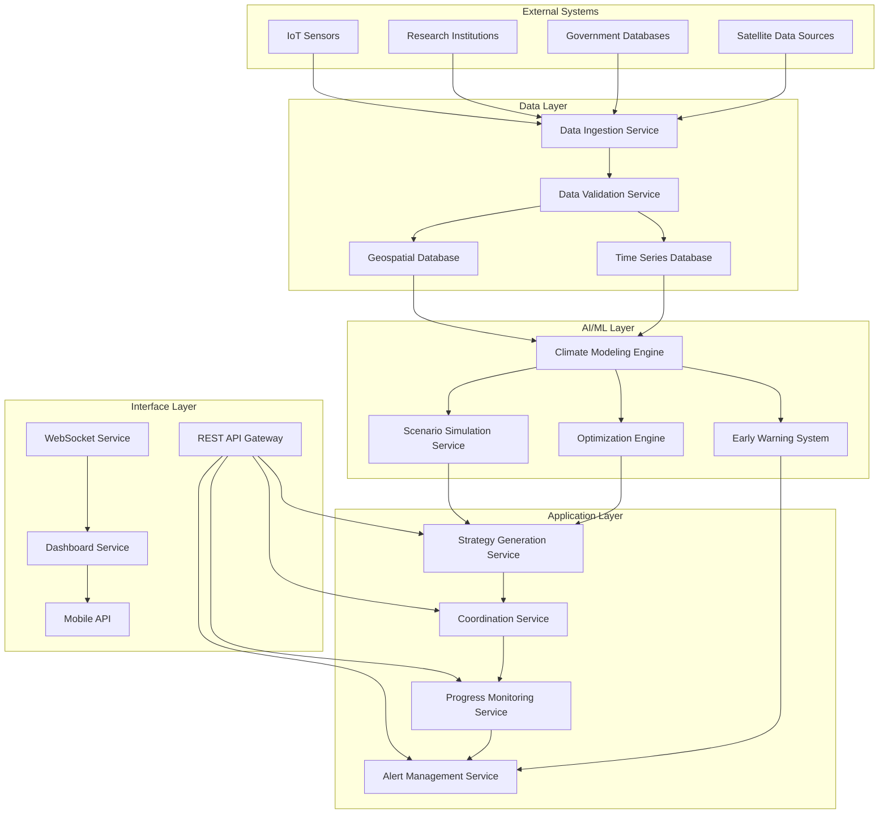

# Design Document: Global Climate Action AI Coordinator

## Overview

The Global Climate Action AI Coordinator is a sophisticated AI-powered platform that addresses the urgent need for coordinated global climate action. The system integrates real-time climate data from diverse sources, employs advanced modeling techniques to simulate intervention impacts, and uses multi-objective optimization to generate optimal climate action strategies.

The platform serves as a central coordination hub for governments, industries, researchers, and communities, enabling evidence-based decision-making and synchronized climate action at unprecedented scale and speed. By leveraging cutting-edge AI techniques including multi-agent reinforcement learning and integrated assessment modeling, the system can process complex climate-economic interactions and provide actionable recommendations for achieving global climate targets.

## Architecture

The system follows a microservices architecture with clear separation of concerns, designed for global scale and high availability:



### Key Architectural Principles

- **Scalability**: Horizontal scaling with containerized microservices
- **Resilience**: Circuit breakers, retry mechanisms, and graceful degradation
- **Security**: Zero-trust architecture with end-to-end encryption
- **Interoperability**: Standards-based APIs and data formats
- **Real-time Processing**: Event-driven architecture with streaming data pipelines

## Components and Interfaces

### Data Ingestion Service

**Purpose**: Continuously collect and normalize climate data from diverse global sources

**Key Features**:
- Multi-protocol data ingestion (REST, FTP, streaming APIs)
- Real-time processing of satellite feeds (OCO-2, Sentinel-5P, Carbon Mapper)
- Integration with major climate databases (NOAA, Copernicus, Climate TRACE)
- Automated data quality assessment and anomaly detection

**Interfaces**:
```typescript
interface DataIngestionService {
  ingestSatelliteData(source: SatelliteSource, data: RawSatelliteData): Promise<void>
  ingestGovernmentData(country: string, data: EmissionsReport): Promise<void>
  validateDataQuality(data: ClimateData): DataQualityReport
  scheduleDataCollection(source: DataSource, frequency: Duration): void
}
```

### Climate Modeling Engine

**Purpose**: Core AI engine for climate impact simulation and scenario analysis

**Key Features**:
- Integration with established IAM frameworks (GCAM, MESSAGE, REMIND)
- Multi-agent reinforcement learning for policy optimization
- Uncertainty quantification and confidence interval calculation
- Support for both process-based and cost-benefit modeling approaches

**Interfaces**:
```typescript
interface ClimateModelingEngine {
  simulateScenario(interventions: Intervention[], timeHorizon: number): ScenarioResult
  calculateEmissionReductions(intervention: Intervention): EmissionImpact
  assessUncertainty(scenario: Scenario): UncertaintyBounds
  updateModelParameters(newData: ClimateData): void
}
```

### Optimization Engine

**Purpose**: Multi-objective optimization for generating optimal climate action strategies

**Key Features**:
- Pareto-optimal solution generation balancing climate, economic, and equity objectives
- Constraint handling for political feasibility and resource limitations
- Dynamic programming for temporal optimization
- Integration with reinforcement learning for adaptive strategy refinement

**Interfaces**:
```typescript
interface OptimizationEngine {
  optimizeStrategy(
    objectives: ClimateObjective[], 
    constraints: PolicyConstraint[], 
    context: RegionalContext
  ): ActionPlan[]
  
  evaluateTradeoffs(plan: ActionPlan): TradeoffAnalysis
  refineStrategy(plan: ActionPlan, feedback: ImplementationFeedback): ActionPlan
}
```

### Coordination Service

**Purpose**: Manage stakeholder coordination and progress tracking

**Key Features**:
- Stakeholder registration and role-based access control
- Task assignment and deadline management
- Conflict detection and resolution recommendations
- Real-time collaboration features

**Interfaces**:
```typescript
interface CoordinationService {
  registerStakeholder(stakeholder: Stakeholder): StakeholderId
  assignAction(actionId: string, stakeholderId: StakeholderId): void
  trackProgress(actionId: string): ProgressStatus
  detectConflicts(actions: Action[]): ConflictReport[]
}
```

### Early Warning System

**Purpose**: Monitor critical climate thresholds and generate automated alerts

**Key Features**:
- Real-time threshold monitoring for atmospheric CO₂, temperature anomalies
- Predictive modeling for extreme weather events
- Natural language processing for research and news analysis
- Escalation procedures and stakeholder notification

**Interfaces**:
```typescript
interface EarlyWarningSystem {
  monitorThresholds(thresholds: ClimateThreshold[]): void
  generateAlert(threshold: ClimateThreshold, currentValue: number): Alert
  analyzeNewsFeeds(sources: NewsSource[]): ClimateEvent[]
  predictExtremeWeather(region: Region, timeframe: Duration): WeatherPrediction[]
}
```

## Data Models

### Core Climate Data

```typescript
interface ClimateData {
  id: string
  timestamp: Date
  source: DataSource
  location: GeoLocation
  dataType: ClimateDataType
  value: number
  unit: string
  confidence: number
  metadata: Record<string, any>
}

interface EmissionData extends ClimateData {
  sector: EmissionSector
  gasType: GreenhouseGas
  scope: EmissionScope
}

interface AtmosphericData extends ClimateData {
  altitude: number
  measurement: AtmosphericMeasurement
}
```

### Action Planning Models

```typescript
interface ActionPlan {
  id: string
  name: string
  description: string
  interventions: Intervention[]
  timeline: Timeline
  expectedImpact: ClimateImpact
  cost: EconomicCost
  stakeholders: StakeholderId[]
  status: PlanStatus
}

interface Intervention {
  id: string
  type: InterventionType
  sector: Sector
  description: string
  implementation: ImplementationDetails
  impact: ImpactProjection
  feasibility: FeasibilityAssessment
}

interface ClimateImpact {
  emissionReduction: number
  temperatureEffect: number
  timeToEffect: Duration
  uncertainty: UncertaintyRange
  cobenefits: Cobenefit[]
}
```

### Stakeholder and Coordination Models

```typescript
interface Stakeholder {
  id: StakeholderId
  name: string
  type: StakeholderType
  region: Region
  capabilities: Capability[]
  commitments: Commitment[]
  contactInfo: ContactInfo
}

interface ProgressStatus {
  actionId: string
  completionPercentage: number
  milestones: Milestone[]
  lastUpdate: Date
  issues: Issue[]
  nextDeadline: Date
}
```

## Correctness Properties

*A property is a characteristic or behavior that should hold true across all valid executions of a system—essentially, a formal statement about what the system should do. Properties serve as the bridge between human-readable specifications and machine-verifiable correctness guarantees.*

Before defining the correctness properties, I need to analyze the acceptance criteria from the requirements to determine which are testable as properties.

<function_calls>
<invoke name="prework">
<parameter name="featureName">global-climate-coordinator